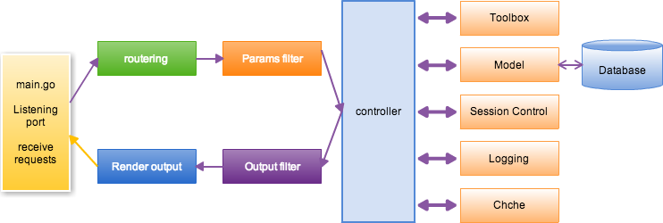

# What is Beego?

Beego is a RESTful HTTP framework for the rapid development of Go applications including APIs, web apps and backend services with integrated Go specific features such as interfaces and struct embedding.

## The architecture of Beego

Beego is built upon 8 loosely linked modules that can be used independently or as part of Beego's HTTP logic. This high level of modularity gives Beego an unprecedented level of flexibility to meet developer needs.


## The execution logic of Beego

Beego uses a standard Model-View-Controller (MVC) architecture for logic execution.



## The project structure of Beego

Here is the typical folder structure of a Beego project:

```
├── conf
│   └── app.conf
├── controllers
│   ├── admin
│   └── default.go
├── main.go
├── models
│   └── models.go
├── static
│   ├── css
│   ├── ico
│   ├── img
│   └── js
└── views
    ├── admin
    └── index.tpl
```

M (models), V (views), C (controllers) each have top level folders. `main.go` is the entry point.

## Creating a Beego project

Ready to try Beego?  You can use the [bee tool to create a new project](../install/bee.md).
