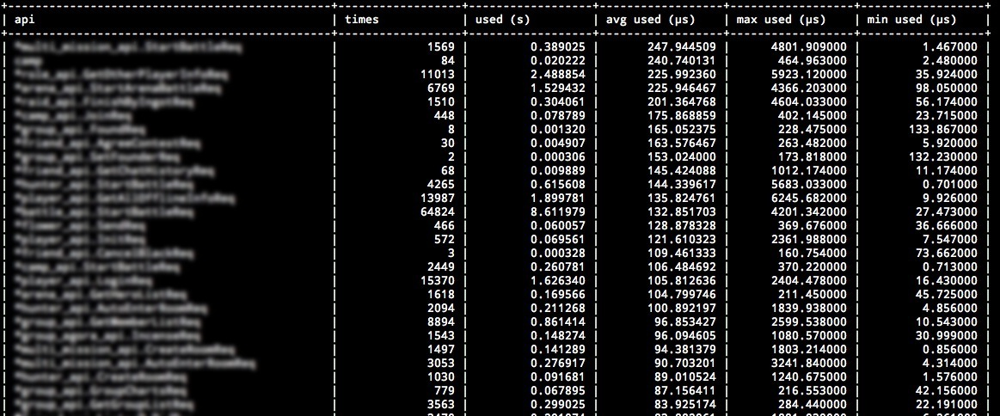

# Core Toolbox Module

This module is based on the [Dropwizard framework](https://github.com/dropwizard/dropwizard) for Java. One user told me about this framework and it's cool stuff. [Issue 128](https://github.com/astaxie/beego/issues/128) talked about this feature. I added more cool features. Here are the features: healthcheck, profiling, statistics and tasks.

## Installation

	go get github.com/astaxie/beego/toolbox

## Healthcheck

It can check the health status of your application. E.g.: To check if database is available:

```
type DatabaseCheck struct {
}

func (dc *DatabaseCheck) Check() error {
	if dc.isConnected() {
		return nil
	} else {
		return errors.New("can't connect database")
	}
}
```
Then you can add it as a check item:

```
toolbox.AddHealthCheck("database",&DatabaseCheck{})
```

After this you can send get request to `/healthcheck`:

	$ curl http://beego.me:8088/healthcheck
	* deadlocks: OK
	* database: OK

It will return the database status accordingly.

## Profiling

Monitoring the performance of running processes is a very good way to optimize performance and to look for issues in our application. E.g.: information of GC and goroutine.

Profile provides a easy entry point for you to debug the application. It uses the `ProcessInput` entry function to process the requests. Here are some debugging types:

- lookup goroutine

	Print out the tasks of all goroutines which are currently running. You can easily see what all goroutines are doing.

		goroutine 3 [running]:
		runtime/pprof.writeGoroutineStacks(0x634238, 0xc210000008, 0x62b000, 0xd200000000000000)
			/Users/astaxie/go/src/pkg/runtime/pprof/pprof.go:511 +0x7c
		runtime/pprof.writeGoroutine(0x634238, 0xc210000008, 0x2, 0xd2676410957b30fd, 0xae98)
			/Users/astaxie/go/src/pkg/runtime/pprof/pprof.go:500 +0x3c
		runtime/pprof.(*Profile).WriteTo(0x52ebe0, 0x634238, 0xc210000008, 0x2, 0x1, ...)
			/Users/astaxie/go/src/pkg/runtime/pprof/pprof.go:229 +0xb4
		_/Users/astaxie/github/beego/toolbox.ProcessInput(0x2c89f0, 0x10, 0x634238, 0xc210000008)
			/Users/astaxie/github/beego/toolbox/profile.go:26 +0x256
		_/Users/astaxie/github/beego/toolbox.TestProcessInput(0xc21004e090)
			/Users/astaxie/github/beego/toolbox/profile_test.go:9 +0x5a
		testing.tRunner(0xc21004e090, 0x532320)
			/Users/astaxie/go/src/pkg/testing/testing.go:391 +0x8b
		created by testing.RunTests
			/Users/astaxie/go/src/pkg/testing/testing.go:471 +0x8b2

		goroutine 1 [chan receive]:
		testing.RunTests(0x315668, 0x532320, 0x4, 0x4, 0x1)
			/Users/astaxie/go/src/pkg/testing/testing.go:472 +0x8d5
		testing.Main(0x315668, 0x532320, 0x4, 0x4, 0x537700, ...)
			/Users/astaxie/go/src/pkg/testing/testing.go:403 +0x84
		main.main()
			_/Users/astaxie/github/beego/toolbox/_test/_testmain.go:53 +0x9c

- lookup heap

	Print out information of current heap:

		heap profile: 1: 288 [2: 296] @ heap/1048576
		1: 288 [2: 296] @


		# runtime.MemStats
		# Alloc = 275504
		# TotalAlloc = 275512
		# Sys = 4069608
		# Lookups = 5
		# Mallocs = 469
		# Frees = 1
		# HeapAlloc = 275504
		# HeapSys = 1048576
		# HeapIdle = 647168
		# HeapInuse = 401408
		# HeapReleased = 0
		# HeapObjects = 468
		# Stack = 24576 / 131072
		# MSpan = 4472 / 16384
		# MCache = 1504 / 16384
		# BuckHashSys = 1476472
		# NextGC = 342976
		# PauseNs = [370712 77378 0 0 0 0 0 0 0 0 0 0 0 0 0 0 0 0 0 0 0 0 0 0 0 0 0 0 0 0 0 0 0 0 0 0 0 0 0 0 0 0 0 0 0 0 0 0 0 0 0 0 0 0 0 0 0 0 0 0 0 0 0 0 0 0 0 0 0 0 0 0 0 0 0 0 0 0 0 0 0 0 0 0 0 0 0 0 0 0 0 0 0 0 0 0 0 0 0 0 0 0 0 0 0 0 0 0 0 0 0 0 0 0 0 0 0 0 0 0 0 0 0 0 0 0 0 0 0 0 0 0 0 0 0 0 0 0 0 0 0 0 0 0 0 0 0 0 0 0 0 0 0 0 0 0 0 0 0 0 0 0 0 0 0 0 0 0 0 0 0 0 0 0 0 0 0 0 0 0 0 0 0 0 0 0 0 0 0 0 0 0 0 0 0 0 0 0 0 0 0 0 0 0 0 0 0 0 0 0 0 0 0 0 0 0 0 0 0 0 0 0 0 0 0 0 0 0 0 0 0 0 0 0 0 0 0 0 0 0 0 0 0 0 0 0 0 0 0 0 0 0 0 0 0 0]
		# NumGC = 2
		# EnableGC = true
		# DebugGC = false

- lookup threadcreate

	Print out information of threads:

		threadcreate profile: total 4
		1 @ 0x17f68 0x183c7 0x186a8 0x188cc 0x19ca9 0xcf41 0x139a3 0x196c0
		#	0x183c7	newm+0x27			/Users/astaxie/go/src/pkg/runtime/proc.c:896
		#	0x186a8	startm+0xb8			/Users/astaxie/go/src/pkg/runtime/proc.c:974
		#	0x188cc	handoffp+0x1ac			/Users/astaxie/go/src/pkg/runtime/proc.c:992
		#	0x19ca9	runtime.entersyscallblock+0x129	/Users/astaxie/go/src/pkg/runtime/proc.c:1514
		#	0xcf41	runtime.notetsleepg+0x71	/Users/astaxie/go/src/pkg/runtime/lock_sema.c:253
		#	0x139a3	runtime.MHeap_Scavenger+0xa3	/Users/astaxie/go/src/pkg/runtime/mheap.c:463

		1 @ 0x17f68 0x183c7 0x186a8 0x188cc 0x189c3 0x1969b 0x2618b
		#	0x183c7	newm+0x27		/Users/astaxie/go/src/pkg/runtime/proc.c:896
		#	0x186a8	startm+0xb8		/Users/astaxie/go/src/pkg/runtime/proc.c:974
		#	0x188cc	handoffp+0x1ac		/Users/astaxie/go/src/pkg/runtime/proc.c:992
		#	0x189c3	stoplockedm+0x83	/Users/astaxie/go/src/pkg/runtime/proc.c:1049
		#	0x1969b	runtime.gosched0+0x8b	/Users/astaxie/go/src/pkg/runtime/proc.c:1382
		#	0x2618b	runtime.mcall+0x4b	/Users/astaxie/go/src/pkg/runtime/asm_amd64.s:178
		
		1 @ 0x17f68 0x183c7 0x170bc 0x196c0
		#	0x183c7	newm+0x27		/Users/astaxie/go/src/pkg/runtime/proc.c:896
		#	0x170bc	runtime.main+0x3c	/Users/astaxie/go/src/pkg/runtime/proc.c:191
		
		1 @

- lookup block

	Print out information of block:

		--- contention:
		cycles/second=2294781025

- start cpuprof

	Start recording cpuprof info into created file cpu-pid.pprof.

- stop cpuprof

	Stop recording.

- get memprof

	Start recording memprof into created file mem-pid.memprof

- gc summary

	Check GC status:

		NumGC:2 Pause:54.54us Pause(Avg):170.82us Overhead:177.49% Alloc:248.97K Sys:3.88M Alloc(Rate):1.23G/s Histogram:287.09us 287.09us 287.09us 

## Statistics

Look at this picture, what do you think? It's cool, right? Toolbox module supports it.



How can I use the statistics? Add statistics like this:

	toolbox.StatisticsMap.AddStatistics("POST", "/api/user", "&admin.user", time.Duration(2000))
	toolbox.StatisticsMap.AddStatistics("POST", "/api/user", "&admin.user", time.Duration(120000))
	toolbox.StatisticsMap.AddStatistics("GET", "/api/user", "&admin.user", time.Duration(13000))
	toolbox.StatisticsMap.AddStatistics("POST", "/api/admin", "&admin.user", time.Duration(14000))
	toolbox.StatisticsMap.AddStatistics("POST", "/api/user/astaxie", "&admin.user", time.Duration(12000))
	toolbox.StatisticsMap.AddStatistics("POST", "/api/user/xiemengjun", "&admin.user", time.Duration(13000))
	toolbox.StatisticsMap.AddStatistics("DELETE", "/api/user", "&admin.user", time.Duration(1400))

Get statistics information:
	
	toolbox.StatisticsMap.GetMap(os.Stdout)	

Here is the output:

	| requestUrl                                        | method     | times            | used             | max used         | min used         | avg used         |
	| /api/user                                         | POST       |  2               | 122.00us         | 120.00us         | 2.00us           | 61.00us          |
	| /api/user                                         | GET        |  1               | 13.00us          | 13.00us          | 13.00us          | 13.00us          |
	| /api/user                                         | DELETE     |  1               | 1.40us           | 1.40us           | 1.40us           | 1.40us           |
	| /api/admin                                        | POST       |  1               | 14.00us          | 14.00us          | 14.00us          | 14.00us          |
	| /api/user/astaxie                                 | POST       |  1               | 12.00us          | 12.00us          | 12.00us          | 12.00us          |
	| /api/user/xiemengjun                              | POST       |  1               | 13.00us          | 13.00us          | 13.00us          | 13.00us          |	

## Tasks

Tasks work very similarly to cron jobs. Tasks are used to run a job outside the normal request/response cycle. These can be adhoc or scheduled to run regularly.
Examples include: Reporting memory and goroutine status, periodically triggering GC or cleaning up log files at fixed intervals.

### Creating a new Task

To initialize a task implement [https://godoc.org/github.com/astaxie/beego/toolbox#NewTask](toolbox.NewTask):

	tk1 := toolbox.NewTask("tk1", "0 12 * * * *", func() error {
		fmt.Println("tk1")
		return nil
	})

The NewTask signature:

	NewTask(tname string, spec string, f TaskFunc) *Task	

- `tname`: Task name
- `spec`: Task format. See below for details.
- `f`: The function which will be run as the task.

To implement this task, add it to the global task list and start it.

	toolbox.AddTask("tk1", tk1)
	toolbox.StartTask()
	defer toolbox.StopTask()

### Testing the TaskFunc

Use the code below to test if the TaskFunc is working correctly.

	err := tk.Run()
	if err != nil {
		t.Fatal(err)
	}
	

### spec in detail

`spec` specifies when the new Task will be run. Its format is the same as that of traditional crontab:

```
// The first 6 parts are:
//       second: 0-59
//       minute: 0-59
//       hour: 1-23
//       day: 1-31
//       month: 1-12
//       weekdays: 0-6（0 is Sunday）

// Some special sign:
//       *: any time
//       ,: separator. E.g.: 2,4 in the third part means run at 2 and 4 o'clock
//　　    －: range. E.g.: 1-5 in the third part means run between 1 and 5 o'clock
//       /n : run once every n time. E.g.: */1 in the third part means run once every an hour. Same as 1-23/1
/////////////////////////////////////////////////////////
//	0/30 * * * * *                        run every 30 seconds
//	0 43 21 * * *                         run at 21:43
//	0 15 05 * * *                         run at 05:15
//	0 0 17 * * *                          run at 17:00
//	0 0 17 * * 1                          run at 17:00 of every Monday
//	0 0,10 17 * * 0,2,3                   run at 17:00 and 17:10 of every Sunday, Tuesday and Wednesday
//	0 0-10 17 1 * *                       run once every minute from 17:00 to 7:10 on 1st day of every month
//	0 0 0 1,15 * 1                        run at 0:00 on 1st and 15th of each month and every Monday
//	0 42 4 1 * *                          run at 4:42 on 1st of every month
//	0 0 21 * * 1-6                        run at 21:00 from Monday to Saturday
//	0 0,10,20,30,40,50 * * * *            run every 10 minutes
//	0 */10 * * * *                        run every 10 minutes
//	0 * 1 * * *                           run every one minute from 1:00 to 1:59
//	0 0 1 * * *                           run at 1:00
//	0 0 */1 * * *                         run at :00 of every hour
//	0 0 * * * *                           run at :00 of every hour
//	0 2 8-20/3 * * *                      run at 8:02, 11:02, 14:02, 17:02 and 20:02
//	0 30 5 1,15 * *                       run at 5:30 of 1st and 15th of every month
```

## Debug module (Already moved to utils module)

We always use print for debugging. But the default output is not good enough for debugging. Beego provides this debug module

- Display() print result to console
- GetDisplayString() return the string

It print key/value pairs. The following code:

	Display("v1", 1, "v2", 2, "v3", 3)
	
will output:

	2013/12/16 23:48:41 [Debug] at TestPrint() [/Users/astaxie/github/beego/toolbox/debug_test.go:13]
	
	[Variables]
	v1 = 1
	v2 = 2
	v3 = 3	
	
For pointer type:

	type mytype struct {
		next *mytype
		prev *mytype
	}	
	
	var v1 = new(mytype)
	var v2 = new(mytype)

	v1.prev = nil
	v1.next = v2

	v2.prev = v1
	v2.next = nil

	Display("v1", v1, "v2", v2)

The output result

	2013/12/16 23:48:41 [Debug] at TestPrintPoint() [/Users/astaxie/github/beego/toolbox/debug_test.go:26]

	[Variables]
	v1 = &toolbox.mytype{
	    next: &toolbox.mytype{
	        next: nil,
	        prev: 0x210335420,
	    },
	    prev: nil,
	}
	v2 = &toolbox.mytype{
	    next: nil,
	    prev: &toolbox.mytype{
	        next: 0x210335430,
	        prev: nil,
	    },
	}		
