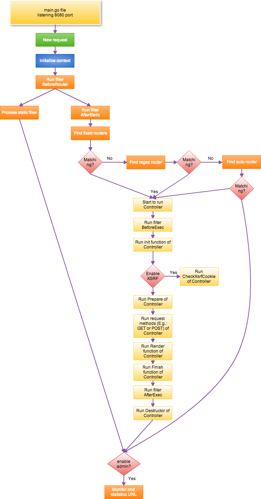

# Introduction to Beego's MVC
 
Beego is a typical MVC framework. Here is it's request handling logic:

Let's describe the whole process:

1. Receive data from the listening port, 8080 by default.
2. Beego start process the request data after the request reach port 8080
3. Initializing Context object. Setting Input if the request is WebSocket request as well as checking if the request method is in the standard methods (get, post, put, delete, patch, options, head) in order to protect from hostile attack.
4. If user set `BeforeRouter` filter, executing `BeforeRouter` filter. If `responseWriter` has output data already while executing this filter, finishing this request and jump to supervise checking.
5. Starting handling static files. If the request url is matching the prefix that set by `StaticDir`, the `ServeFile` in `http` package will be used to handle the static file requests.
6. If it's not static file request, it will initialize session module (if session module is enabled). So you need to know it will have a error if you are using session in `BeforeRouter` filter. You should put it into `AfterStatic` filter.
7. Executing `AfterStatic` filter. If `responseWriter` has output data already while executing this filter, finishing this request and jump to supervise checking.
8. After filters executed it will start to match request url with fixed routing rules. Which means if the request url is `/hello/world`, the `/hello` is not a matching. Only the whole string matching is considered as a matching. If there is a matching, it will execute the matched logic. Otherwise it will go into the regex matching.
9. Regex matching is based on the order that use add them which means the order of the regex routing rules will affect your matching. If some rule is matching, it will execute the matched logic. Otherwise it will go into auto matching.
10. If user registered `AutoRouter`, `controller/method` will be used to match the Controller and method. If matching founded, it will execute it otherwise it will jump to supervise checking.
11. If Controller found, it will start the logic. The first one is `BeforeExec`. If `responseWriter` has output data already while executing this filter, finishing this request and jump to supervise checking.
12. Controller will start executing `Init` function. It will initialize some basic information. Usually it will initialize `bee.Controller`, so it's not recommended to modify this function while inheriting the Controller.
13. If XSRF is enabled, it will call `XsrfToken` of `Controller`. If it's a POST request, `CheckXsrfCookie` will be called.
14. Executing `Prepare` function of `Controller`. Usually this function is for the user to do the initialization. If `responseWriter` has output data already while executing this filter, it will go to the `Finish` function directly.
15. If there is no output, it will execute the function that is registered by user. If there is no function registered by user, the method in `http.Method` (GET/POST and so on) will be called and execute the logic such as reading data, assigning data, and rendering template or output JSON or XML.
16. If there is no output by `responseWrite`, `Render` function will be called to output template.
17. Execute the `Finish` function of `Controller`. This function is used for user to override it in order to release some resources such as data initialized in `Init`.
18. Execute the `AfterExec` filter and if there is output it will jump to supervise checking.
19. Execute the `Destructor` in `Controller` for releasing data allocated in `Init`.
20. If there is no router found till now, the 404 page will be shown.
21. Eventually, all logic went to supervise checking. If the supervisor module is enabled (default on port 8088), the request will be sent to supervisor module to log QPS of the request, visiting time, request url and so on.

Now let dive into the first step of Beego's MVC, routing:

- [Routing](controller/router.md)
- [Controller functions](controller/controller.md)
- [Cross-site request forgery (XSRF)](controller/xsrf.md)
- [Session control](controller/session.md)
- [Message flashing](controller/flash.md)
- [Accessing Request Data](controller/params.md)
- [Multiple Response Formats](controller/jsonxml.md)
- [Form validation](controller/validation.md)
- [Rendering templates](controller/view.md)
- [Template functions](controller/template.md)
- [Error handling](controller/errors.md)
- [Handling static files](controller/static.md)
- [Parameter configuration](controller/config.md)
- [Logging](controller/logs.md)
