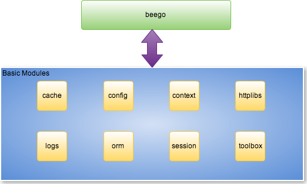

# Beego Nedir?

Beego, Go dili ile hızlıca API'ları, web uygulamalarını ve backend servislerini geliştirmenizi sağlayan RESTful HTTP framework'tür. Go'nun spesifik interface ve struct embedding yapılarına bağlı olarak çalışır.

## Beego'nun mimarisi

Beego bağımsız veya Beego'nun HTTP mantığının bir parçası olarak kullanılabilecek 8 gevşek bağlantılı (loosely linked) modül üzerine kurulmuştur. Bu yüksek seviyedeki modülerlik Beego'ya, geliştirici ihtiyaçlarını karşılayabilmek için eşi görülmemiş esneklik sağlar.



## Beego'nun çalışma mantığı

Beego çalışma mantığı olarak standart Model-View-Controller (MVC) mimarisini kullanır.


## Beego'nun proje yapısı

Tipik bir Beego projesinin klasör yapısı: 

```
├── conf
│   └── app.conf
├── controllers
│   ├── admin
│   └── default.go
├── main.go
├── models
│   └── models.go
├── static
│   ├── css
│   ├── ico
│   ├── img
│   └── js
└── views
    ├── admin
    └── index.tpl
```

M (modeller), V (viewlar), C (controllerlar) üst seviye klasörlerdir. `main.go` ise giriş noktasıdır.

## Beego projesi oluşturmak

Beego'yu denemek için hazır mısın? Yeni proje oluşturmak için [bee aracını](../install/bee.md) kullanabilirsin.
