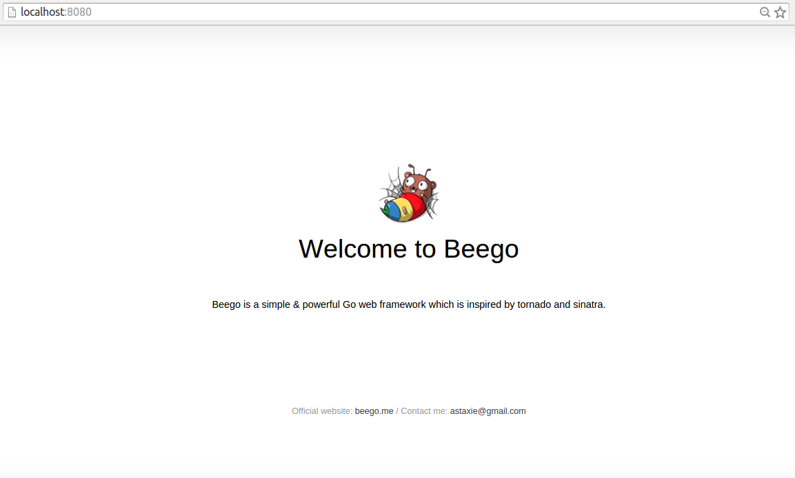

# Requirements

Before starting any Beego project make sure that you have installed the `bee` tool and the `beego` package. If you don't have them yet please read [Installing beego](../install) and [Installing bee tool](../install/bee.md) before you proceed.  

# Creating a new project

Create a new Beego project with the [`bee` command](../install/bee.md). 

Open a terminal to your `$GOPATH` directory and enter `bee new quickstart`:

	➜  src  bee new quickstart
	[INFO] Creating application...
	/gopath/src/quickstart/
	/gopath/src/quickstart/conf/
	/gopath/src/quickstart/controllers/
	/gopath/src/quickstart/models/
	/gopath/src/quickstart/routers/
	/gopath/src/quickstart/tests/
	/gopath/src/quickstart/static/
	/gopath/src/quickstart/static/js/
	/gopath/src/quickstart/static/css/
	/gopath/src/quickstart/static/img/
	/gopath/src/quickstart/views/
	/gopath/src/quickstart/conf/app.conf
	/gopath/src/quickstart/controllers/default.go
	/gopath/src/quickstart/views/index.tpl
	/gopath/src/quickstart/routers/router.go
	/gopath/src/quickstart/tests/default_test.go
	2015/05/02 11:55:28 [SUCC] New application successfully created!

The bee tool has created a new Beego project with the following structure:

	quickstart
	├── conf
	│   └── app.conf
	├── controllers
	│   └── default.go
	├── main.go
	├── models
	├── routers
	│   └── router.go
	├── static
	│   ├── css
	│   ├── img
	│   └── js
	├── tests
	│   └── default_test.go
	└── views
	    └── index.tpl

This is a typical MVC application and `main.go` is the project's main file.

## Running project

Go to the path of the newly created project and enter `bee run` to compile and run the project. 

	➜  src  cd quickstart
	➜  quickstart  bee run
	2015/05/02 12:01:31 [INFO] Uses 'quickstart' as 'appname'
	2015/05/02 12:01:31 [INFO] Initializing watcher...
	2015/05/02 12:01:31 [TRAC] Directory(/gopath/src/quickstart/controllers)
	2015/05/02 12:01:31 [TRAC] Directory(/gopath/src/quickstart)
	2015/05/02 12:01:31 [TRAC] Directory(/gopath/src/quickstart/routers)
	2015/05/02 12:01:31 [TRAC] Directory(/gopath/src/quickstart/tests)
	2015/05/02 12:01:31 [INFO] Start building...
	2015/05/02 12:01:36 [SUCC] Build was successful
	2015/05/02 12:01:36 [INFO] Restarting quickstart ...
	2015/05/02 12:01:36 [INFO] ./quickstart is running...
	2015/05/02 12:01:38 [app.go:103] [I] http server Running on :8080

The web application will run on the default Beego port `8080`. All of this has been accomplished using only Go and Beego, without the need for nginx or apache.  Let's look at our application in the browser now:

Beego makes it so easy to create a web application! Let's dive into the project now and see how everything works in the [next section](router.md).
