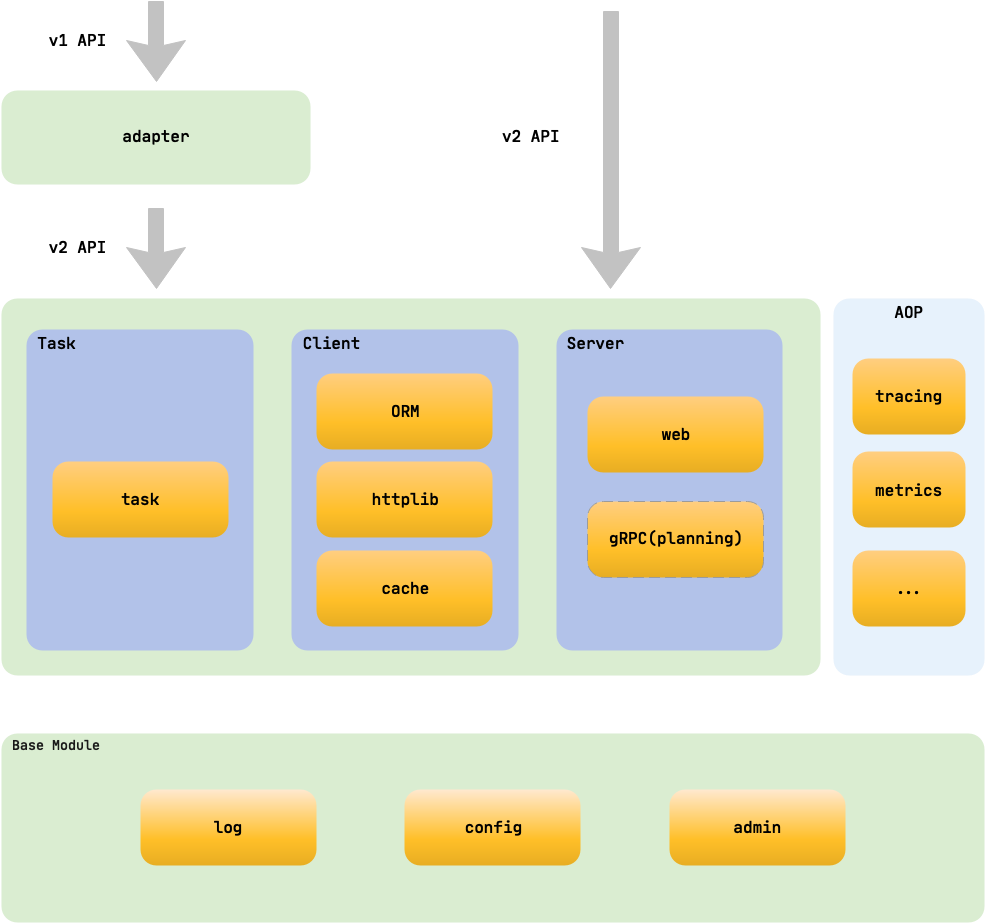

# beego 简介

beego 是一个快速开发 Go 应用的 HTTP 框架，他可以用来快速开发 API、Web 及后端服务等各种应用，是一个 RESTful 的框架，主要设计灵感来源于 tornado、sinatra 和 flask 这三个框架，但是结合了 Go 本身的一些特性（interface、struct 嵌入等）而设计的一个框架。

## beego 的架构

beego 的整体设计架构如下所示：



beego 是基于八大独立的模块构建的，是一个高度解耦的框架。当初设计 beego 的时候就是考虑功能模块化，用户即使不使用 beego 的 HTTP 逻辑，也依旧可以使用这些独立模块，例如：你可以使用 cache 模块来做你的缓存逻辑；使用日志模块来记录你的操作信息；使用 config 模块来解析你各种格式的文件。所以 beego 不仅可以用于 HTTP 类的应用开发，在你的 socket 游戏开发中也是很有用的模块，这也是 beego 为什么受欢迎的一个原因。大家如果玩过乐高的话，应该知道很多高级的东西都是一块一块的积木搭建出来的，而设计 beego 的时候，这些模块就是积木，高级机器人就是 beego。至于这些模块的功能以及如何使用会在后面的文档逐一介绍。

## beego 的执行逻辑

既然 beego 是基于这些模块构建的，那么它的执行逻辑是怎么样的呢？beego 是一个典型的 MVC 架构，它的执行逻辑如下图所示：


## beego 项目结构

一般的 beego 项目的目录如下所示：

```
├── conf
│   └── app.conf   
├── controllers
│   ├── admin
│   └── default.go
├── main.go
├── models
│   └── models.go
├── static
│   ├── css
│   ├── ico
│   ├── img
│   └── js
└── views
    ├── admin
    └── index.tpl
```
从上面的目录结构我们可以看出来 M（models 目录）、V（views 目录）和 C（controllers 目录）的结构， `main.go` 是入口文件。

>你可以通过 [bee 工具来新建项目](../install/bee.md)。
