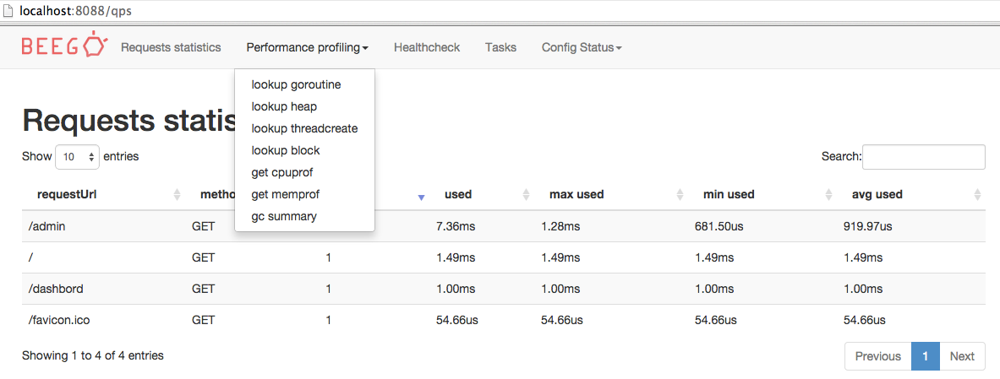

# beego 1.6.1
新增功能：
1. ORM支持Oracle驱动
2. ORM的Model支持inline
3. Cache支持ssdb引擎
4. console支持颜色输出配置
5. 添加travis的自动化集成测试
6. 日志新增mulitfile引擎，支持不同级别的输出到不同的文件

bugfix：
1. cookie时间设置
2. 路由规则里面的匹配 [#1580](https://github.com/astaxie/beego/issues/1580)
3. 在beego.Run()之前没有log输出
4. config获取[]string为空的时候返回为空，应该返回nil
5. ini接口保存的时候需要注释不正确
6. 异步存储日志的时候时间可能延迟的问题
7. 配置文件解析两次，导致部署key获取失败
8. 正则路由无法解析本身带有`()`的问题
9. mail发送中文附件和title乱码的问题
10. ORM里面缺少Distinct的接口定义
11. Layout编译失败
12. logrotate的时候文件名不正确
13. CORS插件失败的时候不生效
14. filters的路径参数和路由参数冲突
15. 静态文件找不到返回200，应该返回404
16. 添加GroupBy的interface支持
17. Go1.6的并发访问map引起静态文件换成崩溃
18. httplib JSONBody输出的时候采用json.Encoder会输出一个额外的换行符
19. 异步模式下，log调用flush，Close的时候日志丢失

# beego 1.6.0
新功能：

1. 文件log支持rotate支持类似`xx.2013-01-01.2.log`这样的输出 [#1265](https://github.com/astaxie/beego/pull/1265)
2. context.response 支持了原生的Flush，Hijack，CloseNotify
3. ORM支持Distinct操作 [#1276](https://github.com/astaxie/beego/pull/1276)
4. 新增加模板函数map_get [#1305](https://github.com/astaxie/beego/pull/1305)
5. ORM支持tidb引擎 [#1366](https://github.com/astaxie/beego/pull/1366)
6. httplib请求参数支持[]string [#1308](https://github.com/astaxie/beego/pull/1308)
7. ORM querySeter添加GroupBy方法 [#1345](https://github.com/astaxie/beego/pull/1345)
8. Session的MySQL引擎支持自定义表名 [#1348](https://github.com/astaxie/beego/pull/1348)
9. log的file引擎性能提升30%，同时支持自定义创建的文件权限 [#1560](https://github.com/astaxie/beego/pull/1560)
10. session支持通过query获取 [#1507](https://github.com/astaxie/beego/pull/1507)
11. Cache模块支持多个Cache对象，之前调用NewCache获取的是同一个Cache，现在会初始化不同的Cache对象。
12. validation支持自定义验证函数

bugfix:

1. context里面bind函数如果参数为空crash [#1245](https://github.com/astaxie/beego/issues/1245)
2. ORM中manytomany获取reverse的时候出错。[#671](https://github.com/astaxie/beego/issues/671)
3. http: multiple response.WriteHeader calls [#1329](https://github.com/astaxie/beego/pull/1329)
4. ParseForm解析日期使用当前的timezone [#1343](https://github.com/astaxie/beego/pull/1343)
5. log引擎里面Smtp发送邮件无法认证
6. 修复路由规则的一些issue: `/topic/:id/?:auth`, `/topic/:id/?:auth:int` [#1349](https://github.com/astaxie/beego/pull/1349)
7. 修复注释文档解析的时候nil引起crash [#1367](https://github.com/astaxie/beego/pull/1367)
8. static目录下的index.html无法读取[#1508](https://github.com/astaxie/beego/pull/1508)
9. dbBase.Update失败不返回err [#1384](https://github.com/astaxie/beego/pull/1384)
10. validation里面设置的Required只对int有效，int64无效
11. ORM创建外键是string类型的主键时创建varchar(0)的字符问题 [#1379](https://github.com/astaxie/beego/pull/1379)
12. graceful同时开启http和https的时候出错 [#1414](https://github.com/astaxie/beego/pull/1414)
13. ListenTCP4开启之后如果httpaddr为空还是监控TCP6
14. migration不支持postgres [#1434](https://github.com/astaxie/beego/pull/1434)
15. ORM text、bool等默认值问题导致创建表出错
16. graceful导致panic问题 negative WaitGroup counter

优化:

1. example 移到了 [samples](https://github.com/beego/samples)
2. 所有代码符合golint规范
3. 重写路由树底层，性能提升三倍左右
4. 每次请求的context采用sync.Pool复用，内存和性能提升
5. 模板编译优化速度，按需编译 [#1298](https://github.com/astaxie/beego/pull/1298)
6. 优化了beego的配置管理，采用统一的BConfig，更易读易管理
7. 优化了beego的整体结构代码，使得代码更易读维护
8. 所有初始化的信息统一到AddAPPStartHook函数中去，易于管理
9. 移除了middleware，之后全部采用plugins来管理插件
10. 重构Error处理，使得Error更加易懂

# beego 1.5.0
新功能:

1. 优雅重启模块：grace
2. httplib增加JsonBody函数，支持raw body以Json格式发送
3. context input增加 AcceptsHtml AcceptsXml AcceptsJson 函数
4. 配置文件优先从Runmode中获取
5. httplib 支持gzip
6. Log模块默认不采用异步方式
7. validation 增加循环嵌套验证
8. 增加apk mime
9. ORM支持eq和ne

bugfix:

1. ledis驱动的参数错误
2. 当页面放置一段时间，验证码将从缓存中失效。当用户再来刷新验证码将出现验证码404。对于reload操作应该直接生成验证码。
3. Controller定义Error异常
4. 修复cookie无法在window下的IE正常工作
5. GetInt函数当获取不存在的变量是返回nil错误
6. 增加更多的手机验证码方式
7. 修复路由的匹配问题
8. panic返回 http 200
9. redis session引起数据库设置错误
10. https和http 直接的session无法共享
11. memcache session引擎当没有数据的时候返回错误

# beego 1.4.3
新功能:

1. ORM数据库创建和修改的时候支持default设置
2. 改进日志文件行数统计
3. sesesion ledis支持选择数据库
4. session redis支持选择数据库
5. cache redis支持选择数据库
6. UrlFor支持任意类型的参数
7. controller中GetInt/GetString等Get系列函数支持默认值, 例如：GetInt("a",12)
8. 增加CompareNot/NotNil 模板函数
9. 支持Controller定义错误处理，更多请参考[controller Error](http://beego.me/docs/mvc/controller/errors.md#controller%E5%AE%9A%E4%B9%89error)
10. ParseForm增加支持slices
11. 改进ORM interface，可以模拟interface

bugfix:

1. context subdomain获取的子域名不正确
2. beego.AppConfig.Strings 当数据为空时判定不正确
3. utils/pagination 修复不能修改分页属性
4. 路由处理中如果请求的URL是空导致crash的问题
5. adminui 中 task 点击无法执行
6. CGI模式退出进程后Socket文件没有删除


# beego 1.4.2
新功能：

1. 增加了SQL构造器，参考了ZEND框架的ORM
2. Controller获取参数增加了GetInt(), GetInt8(), GetInt16(), GetInt32(), GetInt64()
3. 优化日志提示，增加日志输出过滤设置FilterHandler，默认静态文件不输出匹配日志输出
4. 静态目录支持index.html输出，静态目录自动增加/
5. flash支持success和set函数，支持各种一次性的数据
6. 路由支持大小写忽略设置,RouterCaseSensitive, 默认是大小写敏感的URL，根据用户注册的URL进行匹配
7. 配置文件支持自定义的变量获取，beego.AppConfig.String("myvar")在dev下返回456，在其他模式下返回123

    > runmode = dev
    > myvar = 123
    > [dev]
    > myvar = 456

8. ini配置文件支持include语法，在配置文件中允许include其他配置文件：

    > appname = btest
    > include b.conf

9. utils下增加分页组件，可以方便用户编写分页相关的应用。
10. 增加BEEGO_RUNMODE环境变量，用户在部署的时候只要通过改变量方便切换应用的不同模式
11. toolbox增加获取statistic的Json函数
12. utils下的mail发送内嵌附件发送
13. 允许用户通过标准IO开启fastcgi
14. redis Session引擎，采用SETEX命令兼容老版本的redis
15. RenderForm支持html id和class，使用id和class tag
16. ini配置文件支持BOM头
17. Session增加新的引擎ledis
18. 改进httplib文件上传，采用了io.Pipe支持超大文件上传
19. 支持应用启动直接绑定到TCP4地址上，Go默认是绑定到ipv6，增加配置参数ListenTCP4
20. 表单数据渲染支持off/on/yes/no/1/0解析到bool，支time格式的解析
21. 简化了SessionID的生成，不在采用hmac_sha1算法，直接通过golang内置的rand获取

bugfix:

1. 模拟PUT和DELETE时，_method的值没有大写，导致XSRF验证失败
2. cache如果在StartAndGC初始化失败时，没有返回错误信息
3. httplib修复User-Agent设置不起作用
4. DelStaticPath优化/处理
5. 静态目录多个的时候，文件只会在第一个静态目录找
6. Filter函数在AfterExec和FinishRouter之后多个Filter不能执行的问题
7. 修复在请求方法是模拟的_method是PUT或者DELETE的时候无法正确路由
8. 修复了mime没有初始化的问题
9. log输出文件以及行号不正确
10. httplib修复了当只有一个文件上传一个参数是不能发送的问题
11. 改进了Abort的输出信息，之前如果是没有定义的错误信息不会输出
12. 修复namespace循环嵌套中，如果外层没有Filter的情况下内层Filter无法添加的问题
13. 路由包含多层参数时，路由匹配出错 #824
14. 注释路由，如果存在多个namespace的时候，一个更新，另一个信息丢失 #770
15. urlfor函数调用多余{{placeholder}}问题 #759

# beego 1.4.1
主要更新：

1. context.Input.Url获取path信息，去除了域名，scheme等信息
2. 增加插件apiauth，模拟AWS的加密请求
3. 精简debug输出的路由信息
4. orm字段支持指针类型
5. 改进了httplib功能，增加了BasicAuth，多次请求缓存等功能

bugfix:
1. _method模拟请求put和delete，参数大小写不统一
2. 路由*.*和其他路由正则混用情况下无法解析

# beego 1.4.0
这个版本整整憋了两个月时间，主要是我们真的做了好多功能性上面的改进，这里要感谢所有给beego贡献的用户，也感谢给beego持续提各种改进意见的用户，下面是我们这次改进的特性

1. bee工具的完整性改进，bee现在支持了如下功能：

	bee api 直接从数据库读取数据库表，一键生成API应用带文档，详细介绍看视频：http://www.tudou.com/programs/view/aM7iKLlBlrU/
	- bee generate命令，这个是新增加的命令，可以用来自动化生成代码，主要有如下子命令：

	     - scaffold 类似其他框架的脚手架功能，生成controller、model、view、migration

	     - model 生成CRUD的model

	     - controller 生成CRUD的controller

	     - view  生成CRUD的view文件，内容为空，需要用户自己做UI界面

	     - migration  生成migration文件

	     - appcode  从数据库根据表结构生成model、controller、router

	     - docs  从controller注释自动化生成swagger文档
	- bee migrate 命令，执行migration，支持如下子命令

	     - migrate 执行所有新的migration

	     - rollback 回滚最后一次执行的migration

	     - reset 回滚所有的migration

	     - refresh 回滚所有的migration并从头执行全部的migration
	- bee run改进，默认支持了watchall功能，增加了两个参数gendoc和downdoc

2. config模块增加新的接口，现在config模块支持如下接口，支持直接保存文件：

	```
	type ConfigContainer interface {
	    Set(key, val string) error   // support section::key type in given key when using ini type.
	    String(key string) string    // support section::key type in key string when using ini and json type; Int,Int64,Bool,Float,DIY are same.
	    Strings(key string) []string //get string slice
	    Int(key string) (int, error)
	    Int64(key string) (int64, error)
	    Bool(key string) (bool, error)
	    Float(key string) (float64, error)
	    DefaultString(key string, defaultval string) string      // support section::key type in key string when using ini and json type; Int,Int64,Bool,Float,DIY are same.
	    DefaultStrings(key string, defaultval []string) []string //get string slice
	    DefaultInt(key string, defaultval int) int
	    DefaultInt64(key string, defaultval int64) int64
	    DefaultBool(key string, defaultval bool) bool
	    DefaultFloat(key string, defaultval float64) float64
	    DIY(key string) (interface{}, error)
	    GetSection(section string) (map[string]string, error)
	    SaveConfigFile(filename string) error
	}
	```

3. middleware中支持另一种i18n的支持：

	```
	I18N = middleware.NewLocale("conf/i18n.conf", beego.AppConfig.String("language"))
	```

	配置文件如下：

	```
	{
	  "E-mail Address": {
	    "en": "E-mail Address",
	    "zh": "邮箱地址",
	    "vn": "อีเมล"
	  },
	  "Username": {
	    "en": "Ussername",
	    "zh": "用户名",
	    "vn": "t&ecirc;n truy nhập"
	  }
	}
	```

	使用如下：

	`I18N.Translate("username", "vn")`

4. namespace前缀支持正则：

	```
	beego.NewNamespace("/v1/:uid",
	    beego.NSNamespace("/customer",
	        beego.NSInclude(
	            &controllers.CustomerController{},
	            &controllers.CustomerCookieCheckerController{},
	        ),
	    ),
	)
	```

5. cache和session模块的memcache、redis引擎修改到最新版本的驱动

6. 增加开发打印路由调试功能:

	```
	2014/08/22 09:55:40 [I] | GET | /          | 7.660221504s     | match      | / |
	2014/08/22 09:55:40 [I] | GET | /          | 13.421869836s    | match      | / |
	2014/08/22 09:55:40 [I] | GET | /          | 1.726185752s     | match      | / |
	2014/08/22 09:55:40 [I] | GET | /user/login| 7.494079ms       | match      | /user/login |
	```

7. log 的等级符合RFC5424规范

8. 静态文件处理支持robots.txt,用户放在static目录下即可

9. 增加和简化plugins功能：

	auth 支持basicauth，详细使用请看https://godoc.org/github.com/astaxie/beego/plugins/auth
	cors 支持跨站调用，详细使用请看https://godoc.org/github.com/astaxie/beego/plugins/cors

10. 新增了AdminUI，用户在EnableAdmin的情况下，可以通过界面简单地获取当前应用的各种状态，同时可以很容易的调试性能，监控系统，执行任务，获取配置等

	

11. session配置现在支持设置cookie domain

12. 新增migration包，支持migration的功能

13. getconfg方法改为public方法，用户就可以通过改方法获取相应runmode下的配置文件

14. 改进httplib的方法支持SetAgent和BasicAuth的请求，httplib支持请求一次，读取多次

修复bug：

1. file session在部分情况下内容消失问题
2. docs自动化生成，文件不更新
3. 路由namespace的前缀不支持
4. orm修正detect engine
5. 修复captcha里面当用户验证码输入长度不对时不进行更新
6. 调用setstatus之后后面调用的setHeader全部无效的问题
7. 修复smtp发送邮件需要验证的情况
8. 修复utils下safemap的items问题
9. 修复geturl函数当参数多个时不带?的问题

# beego 1.3.0
经过了一个多月的开发，我们很高兴的宣布，beego1.3.0来了，这个版本我们做了非常多好玩并且有用的功能，升级请看[升级指南](http://beego.me/docs/intro/upgrade.md)

## 路由重写
这一次路由进行了全部改造，从之前的三个路由模式，改成了tree路由，第一性能得到了提升，第二路由支持的格式更加丰富，第三路由更加符合我们的思考方式，

例如现在注册如下路由规则：

	/user/astaxie
	/user/:username

如果你的访问地址是`/user/astaxie`，那么优先匹配固定的路由，也就是第一条，如果访问是`/user/slene`，那么就匹配第二个，和你注册的路由的先后顺序无关

## namespace更优雅
设计namespace主要是为了大家模块化设计的，之前是采用了类似jQuery的链式方式，当然新版本也是支持的，但是由于gofmt的格式无法很直观的看出来整个路由的目录结构，所以我采用了多参数注册方式，现在看上去就更加的优雅：

```
ns :=
beego.NewNamespace("/v1",
    beego.NSNamespace("/shop",
        beego.NSGet("/:id", func(ctx *context.Context) {
            ctx.Output.Body([]byte("shopinfo"))
        }),
    ),
    beego.NSNamespace("/order",
        beego.NSGet("/:id", func(ctx *context.Context) {
            ctx.Output.Body([]byte("orderinfo"))
        }),
    ),
    beego.NSNamespace("/crm",
        beego.NSGet("/:id", func(ctx *context.Context) {
            ctx.Output.Body([]byte("crminfo"))
        }),
    ),
)
```
更多详细信息请参考文档：[namespace](http://beego.me/docs/mvc/controller/router.md#namespace)

## 注解路由
```
// CMS API
type CMSController struct {
    beego.Controller
}

func (c *CMSController) URLMapping() {
    c.Mapping("StaticBlock", c.StaticBlock)
    c.Mapping("AllBlock", c.AllBlock)
}

// @router /staticblock/:key [get]
func (this *CMSController) StaticBlock() {

}

// @router /all/:key [get]
func (this *CMSController) AllBlock() {
}
```
更多请参考文档：[注解路由](http://beego.me/docs/mvc/controller/router.md#%E6%B3%A8%E8%A7%A3%E8%B7%AF%E7%94%B1)

## 自动化文档
自动化文档一直是我梦想中的一个功能，这次借着公司的项目终于实现了出来，我说过beego不仅仅要让开发API快，而且让使用API的用户也能快速的使用我们开发的API，这个就是我开发这个项目的初衷。

可以通过注释自动化的生成文档，并且在线测试，详细的请看下面的截图


而且可以通过文档进行API的测试：


更多请参考文档：[自动化文档](http://beego.me/docs/advantage/docs.md)
## config支持不同模式的配置
在配置文件里面支持section，可以有不同的Runmode的配置，默认优先读取runmode下的配置信息，例如下面的配置文件：

	appname = beepkg
	httpaddr = "127.0.0.1"
	httpport = 9090
	runmode ="dev"
	autorender = false
	autorecover = false
	viewspath = "myview"

	[dev]
	httpport = 8080
	[prod]
	httpport = 8088
	[test]
	httpport = 8888

上面的配置文件就是在不同的runmode下解析不同的配置，例如在dev模式下，httpport是8080，在prod模式下是8088，在test模式下是8888.其他配置文件同理。解析的时候优先解析runmode下地配置，然后解析默认的配置。

## 支持双向的SSL认证
```
config := tls.Config{
    ClientAuth: tls.RequireAndVerifyClientCert,
    Certificates: []tls.Certificate{cert},
    ClientCAs: pool,
}
config.Rand = rand.Reader

beego.BeeApp.Server.TLSConfig = &config
```
## beego.Run支持带参数

beego.Run() 默认执行HttpPort

beego.Run(":8089")

beego.Run("127.0.0.1:8089")

## XSRFKEY的token从15个字符增加到32个字符，增强安全性

## 删除热更新

## 模板函数增加Config，可以方便的在模板中获取配置信息

	{{config returnType key defaultValue}}

	{{config "int" "httpport" 8080}}

## httplib支持cookiejar功能，感谢curvesft

## orm时间格式，如果为空就设置为nil，感谢JessonChan

## config模块支持json解析就一个array格式，感谢chrisport

## bug fix
- 静态文件目录循环跳转
- fix typo


# beego 1.2.0
大家好,经过我们一个多月的努力,今天我们发布一个很帅的版本,之前性能测试框架出来beego已经跃居Go框架第一了,虽然这不是我们的目标,我们的目标是做最好用,最易用的框架.http://www.techempower.com/benchmarks/#section=data-r9&hw=i7&test=json 但是这个版本我们还是在性能和易用性上面做了很多改进.应该说性能更加的接近Go原生应用.

### 新特性:

#### 1.namespace支持

```
	beego.NewNamespace("/v1").
		Filter("before", auth).
		Get("/notallowed", func(ctx *context.Context) {
		ctx.Output.Body([]byte("notAllowed"))
	}).
		Router("/version", &AdminController{}, "get:ShowAPIVersion").
		Router("/changepassword", &UserController{}).
		Namespace(
		beego.NewNamespace("/shop").
			Filter("before", sentry).
			Get("/:id", func(ctx *context.Context) {
			ctx.Output.Body([]byte("notAllowed"))
		}))
```

上面这个代码支持了如下这样的请求URL
- GET       /v1/notallowed
- GET       /v1/version
- GET       /v1/changepassword
- POST     /v1/changepassword
- GET       /v1/shop/123

而且还支持前置过滤,条件判断,无限嵌套namespace

#### 2.beego支持更加自由化的路由方式

RESTful的自定义函数

- beego.Get(router, beego.FilterFunc)
- beego.Post(router, beego.FilterFunc)
- beego.Put(router, beego.FilterFunc)
- beego.Head(router, beego.FilterFunc)
- beego.Options(router, beego.FilterFunc)
- beego.Delete(router, beego.FilterFunc)

```
beego.Get("/user", func(ctx *context.Context) {
	ctx.Output.Body([]byte("Get userlist"))
})
```
更加自由度的Handler

- beego.Handler(router, http.Handler)

可以很容易的集成其他服务

```
import (
    "http"
    "github.com/gorilla/rpc"
    "github.com/gorilla/rpc/json"
)

func init() {
    s := rpc.NewServer()
    s.RegisterCodec(json.NewCodec(), "application/json")
    s.RegisterService(new(HelloService), "")
    beego.Handler("/rpc", s)
}
```

#### 3.支持从用户请求中直接数据bind到指定的对象

例如请求地址如下

	?id=123&isok=true&ft=1.2&ol[0]=1&ol[1]=2&ul[]=str&ul[]=array&user.Name=astaxie

```
var id int
ctx.Input.Bind(&id, "id")  //id ==123

var isok bool
ctx.Input.Bind(&isok, "isok")  //isok ==true

var ft float64
ctx.Input.Bind(&ft, "ft")  //ft ==1.2

ol := make([]int, 0, 2)
ctx.Input.Bind(&ol, "ol")  //ol ==[1 2]

ul := make([]string, 0, 2)
ctx.Input.Bind(&ul, "ul")  //ul ==[str array]

user struct{Name}
ctx.Input.Bind(&user, "user")  //user =={Name:"astaxie"}
```

#### 4.优化解析form的流程,让性能更加提升

#### 5.增加更多地testcase进行自动化测试

#### 6.admin管理模块所有的增加可点击的链接,方便直接查询

#### 7.session的除了memory之外的引擎支持struct存储

#### 8.httplib支持文件直接上传接口

```
b:=httplib.Post("http://beego.me/")
b.Param("username","astaxie")
b.Param("password","123456")
b.PostFile("uploadfile1", "httplib.pdf")
b.PostFile("uploadfile2", "httplib.txt")
str, err := b.String()
if err != nil {
    t.Fatal(err)
}
```
httplib支持自定义协议版本

#### 9.ORM支持struct中有unexport的字段

#### 10.XSRF支持controller级别控制是否启用, 之前XSRF是全局设置只要开启了就会影响所有的 POST PUT DELET请求,但是项目中可能API和页面共存的情况,页面可能不需要类似的XSRF,因此支持在Prepare函数中设置值来控制controller是否启用XSRF. 默认是true,也就是根据全局的来执行.用户可以在prepare中设置是否关闭.

```
func (a *AdminController) Prepare(){
       a.EnableXSRF = false
}
```

#### 11.controller支持ServeFormatted函数,支持根据请求Accept来判断是调用ServeJson还是ServeXML

#### 12.session提供memcache引擎

#### 13.Context中的Download函数支持自定义文件名提供下载

## bug修复

1. session的Cookie引擎修复无法设置过期的bug
2. 修复flash数据的存储和解析问题
3. 修复所有go vet出现的问题
4. 修复ParseFormOrMulitForm问题
5. 修复只有POST才能解析raw body,现在支持除了GET和HEAD之外的其他请求
6. config模块修复xml和yaml无法解析的问题

# beego 1.1.4

发布一个紧急的版本, beego存在一个严重的安全漏洞,请大家更新到最新版本. 顺便把最近做的一起发布了

1. 紧急修复一个安全漏洞,稍后会在beego/SECURITY.md公布详细的情况

2. 静态文件处理独立到文件

3. 第三方依赖库移除,目前如果你使用session/cache/config,使用的是依赖第三方库的,那么现在都移到了子目录,如果你想使用这些就需要在使用的地方采用mysql类似的方式引入

	```
	import (
	     "github.com/astaxie/beego"
	   _ "github.com/astaxie/beego/session/mysql"
	)
	```
4. 修改部分导出的函数为private,因为外部不需要调用

5. 优化formparse的过程,根据不同的content-type进行解析

发布时间: 2014-04-08

# beego 1.1.3
这是一个hotfix的版本,主要是修复了以下bug

1. console日志输出,如果不设置配置文件,不能正常输出

2. 支持了go run main.go,但是main.go没有遵循beego的目录结构,自定义了配置文件或者不存在配置文件,就会panic找不到app.conf.

3. 支持了在go test中解析配置,但是实际上调用TestBeegoInit无法解析配置文件

发布时间: 2014-04-04

# beego 1.1.2
beego1.1.2版本发布,这个版本主要是一些改进:

1. 增加ExceptMethodAppend函数,支持autorouter的时候过滤一些函数

2. 支持自定义FlashName,FlashSeperator

3. ORM支持自定义的类型，例如type MyInt int 这种

4. 修复验证模块返回自定义验证信息

5. 改进logs模块, 增加Init处理error,设置一些不必要的publice函数为pravite

6. 增加PostgreSQL的session引擎

7. logs模块,支持输出调用的文件名和行号,增加设置函数EnableFuncCallDepth,默认关闭

8. 修改session模块中Cookie引擎的一个隐藏bug

9. 模板解析错误的时候,提示语进行了改进

10. 允许用户通过Filter修改Context,跳过beego的路由查找方法,直接使用自己的路由规则.增加参数RunController 和RunMethod

11. 支持go run main.go执行beego的应用

12. 支持go test执行测试用例,无法读取配置文件,模板的问题,增加TestBeegoInit函数调用.

发布时间: 2014-04-03

# beego 1.1.1
这个版本主要是一些bug的修复和增加新功能

1. session模块file引擎无法删除文件,不断刷新引起的文件读取失败问题

2. 文件缓存无法读取struct,改进gob自动化注册

3. session模块增加新引擎couchbase

4. httplib 支持设置 transport 和 proxy

5. 改进context中Cookie函数,默认支持httponly,以及其他一些默认参数行为

6. 验证模块的改进,支持更多地手机号码

7. getstrings函数行为也改成getstring一样,不需要自己parseform

8. session模块redis引擎,在连接失败的情况下返回错误

9. 修复无法添加GroupRouters的bug问题

10. 改进多个静态文件的一些潜在bug,路径匹配问题,以及自动跳转静态目录显示.

11. ORM增加 GetDB 获取已连接的 *sql.DB

12. ORM增加 ResetModelCache 重置已注册缓存的模型struct，方便写测试

13. ORM支持 between

14. ORM支持 sql.Null* 类型

15. 修改 auto_now_add，用户有自定义值时跳过自动设置时间

发布时间: 2014-03-12

# beego 1.1.0
这个版本增加了一些新特性，修复了一些bug

新特性

1. 支持AddAPPStartHook函数
2. 支持插件模式，支持AddGroupRouter，用于插件路由设置
3. response支持HiJacker接口
4. AddFilter支持批量匹配
5. session重构，支持Cookie引擎
6. 主流 ORM 性能测试
7. config增加strings接口，允许设置
8. 支持controller级别的模板渲染控制
9. 增加插件basicauth，可以方便的使用该插件实现认证
10. #436 一次插入多个对象
11. #384 query map to struct

bugfix

1. 修复FileCache的bug
2. websocket的例子修正引用库
3. 当发生程序内部错误时。http的status默认修改为500而不是200
4. gmfim map in memzipfile.go file should use some synchronization mechanism (for example sync.RWMutex) otherwise it errors sometimes.
5.  #440 on_delete 不自动删除的问题
6. #441 时区问题

发布时间: 2014-02-10

# beego 1.0.0
经过了四个多月的重构开发，beego 终于发布了第一个正式稳定版本。这个版本我们进行了重构，同时针对很多细节进行了改进。下面列一些主要的改进功能：

1. 模块化的设计，现在基本上 beego 做成一个轻量的组装框架，重模块的设计，目前实现了cache、config、logs、sessions、httplibs、toolbox、orm、context 等八个模块，以后可能会更多。用户可以直接引用这些模块应用于自己的应用中，不仅仅局限于Web应用，beego用户中有应用logs、config、cache这些模块到页游、手游中。

2. 工程化的设计，部署项目之后，经常需要进行对线上程序进行各种信息的统计和分析，统计包括QPS，分析包括GC、内存使用量、CPU，如果出现问题的时候我们还希望通过profile来调试，那么beego都为你考虑到了这些，集成了监控模块，默认是关闭的，用户可以开启，并在另一个端口监听，通过http://127.0.0.1:8088/访问。

3. 详细的文档，这个版本的文档全部是新写的，在之前文档用户的各方面反馈之后，进行了很多细节上面的改进，目前文档中英文版本都已经完成，中英文文档的评论分离，针对不同的用户群交流。

4. 丰富的示例，这一次更新我们开发组写了三个例子，聊天室、短域名、todo任务三个比较有典型意义的例子。让用户在熟悉beego之前有一个更深入的了解。

5. 全新设计的官方网站，这一次我们通过社区获得了很多人的帮助，logo 设计，网站UI的改进。

6. 越来越多的用户，官方网站列举了一些典型的用户，都是一些比较大的公司，他们内部都在使用beego开发对外的API应用，说明 beego 是得到了线上项目验证的框架。

7. 越来越活跃的社区，在 github上面目前已经差不多有390个的 issue，贡献者超过36个，commit 超过了700个，Google groups 目前还在稳步发展中。

8. 周边产品越来越多，基于beego的开源产品也越来越多，例如cms系统，https://github.com/insionng/toropress  例如管理后台系统，https://github.com/beego/admin

9. beego 的辅助工具越来越强大，bee 工具是专门辅助用户开发 beego 应用的，可以快速的创建应用，动态编译，打包部署等

发布时间: 2013-12-19
